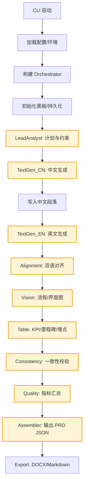

## 多模态双语 PRD 系统与方法讲解（含图解）

本指南面向使用者与论文作者，系统性讲解本仓库的多智能体 PRD 自动生成方法、端到端流程、角色分工、通信与指标、以及上手步骤与扩展建议。可直接作为项目说明/技术附录使用。

---

## 1. 系统目标与产出

- 将「简短业务概要 Brief」自动生成「双语（中/英）、多模态（文本/表格/流程图）」的结构化 PRD。
- 全流程可复现：黑板记录状态与消息、最终产物 JSON 与可阅读文档（Markdown/DOCX）。
- 纯开源栈优先：文本/视觉模型可切换为 Qwen/Doubao/InternVL 等开源模型。

---

## 2. 端到端流程图（Mermaid）

可复制到支持 Mermaid 的编辑器或文档工具中获得可视化图。



---

## 3. 每一步的方法（可操作说明）

1) 输入与启动  
- 准备 Brief：目标、受众、范围、里程碑、KPI 等（示例见 `examples/brief_sample.json`）。  
- 运行命令：`python -m src.cli --brief examples/brief_sample.json --output artifacts`。

2) 黑板初始化  
- 创建线程安全黑板，集中保存共享状态、消息队列与持久化快照（`artifacts/.../blackboard.json`）。  
- 所有 Agent 通过黑板交互，保证可追溯与最小耦合。

3) 需求分析 LeadAnalyst  
- 从 Brief 抽取章节结构、术语词表、Persona 与约束，输出“章节计划 JSON + 执行指令”。  
- 明确锚点与引用规范，便于后续文本/表格/图片一致性。

4) 文本生成 TextGen（中文 → 英文）  
- 依据计划逐章节生成；附带术语锚点与引用信息。  
- 保持段落粒度一致，便于对齐/一致性检查。  
- 重要章节（KPI/风险/里程碑/实验设计）采用更严格模板提示词。

5) 双语对齐 Alignment  
- 检查缺失（章节/段落）、长度差异、数字/指代一致性。  
- 若发现问题，发布“修订消息”最小范围回溯重写（仅修有问题段落）。

6) 视觉生成 Vision  
- 基于“章节计划 + 锚点”生成流程/界面示意图；  
- 若视觉模型不可用则写入占位元数据，保证文档完整性；统一资源命名与路径。

7) 表格生成 Table  
- 生成 KPI/里程碑/埋点等结构化表格（含口径、目标/分期值、触发与字段）。  
- 输出 JSON，通过锚点供正文交叉引用。

8) 一致性检查 Consistency  
- 结构完整度（必备章节/图表）、跨模态引用（正文→图/表存在性）、术语/数值一致性（中/英/表格）。  
- 触发必要回溯，直至通过阈值。

9) 质量汇总 Quality  
- 汇总自动指标（示例：S_comp、S_bi、S_mm、S_tab、S_var），写入黑板与最终产物，支撑实验与人评。

10) 组装输出 Assembler  
- 按 `schemas/prd_schema_v0_9.json` 组装版本化 PRD，保存到 `artifacts/prd_<id>.json`。  
- 同步存档 `blackboard.json` 供审计与复现实验。

11) 文档导出 Export  
- 例：  
  - `python -m src.cli_export --input artifacts/<prd>.json --output exports/<prd>_zh.docx --format docx --language zh`  
  - `python -m src.cli_export --input artifacts/<prd>.json --output exports/<prd>_en.docx --format docx --language en`

---

## 3.1 黑板初始化与持久化机制（代码级）

- 编排器在构造时创建黑板，并将持久化路径指向运行目录下的 `blackboard.json`：

```33:41:src/pipeline/orchestrator.py
self.blackboard = InMemoryBlackboard(
    persist_path=(persist_dir / "blackboard.json") if persist_dir else None
)
...
text_cn = text_model_cn or env_text_cn or MockModelClient()
text_en = text_model_en or env_text_en or MockModelClient()
vision = vision_model or env_vision or MockModelClient()
```

- 黑板是线程安全的内存实现，维护三类核心数据结构：共享状态、消息队列、历史日志；并在关键操作后自动持久化：

```12:28:src/shared/blackboard.py
class InMemoryBlackboard(Blackboard):
    """
    Thread-safe blackboard implementation.
    Stores:
        - shared_state: Nested dictionary describing the evolving PRD draft.
        - message_queue: Pending messages per receiver.
        - history: Chronological log of all messages.
    """
    def __init__(self, persist_path: Optional[Path] = None) -> None:
        self._lock = threading.RLock()
        self._shared_state: Dict[str, Any] = {"sections": {}, "artifacts": {}, "logs": []}
        self._message_queue: Dict[str, List[AgentMessage]] = {}
        self._history: List[AgentMessage] = []
        self._persist_path = persist_path
```

- 消息流转：`post_message` 将消息追加到按接收者分桶的队列，并记录到历史与日志；随后触发 `_persist()`：

```29:48:src/shared/blackboard.py
def post_message(self, message: AgentMessage) -> None:
    with self._lock:
        self._message_queue.setdefault(message.receiver, []).append(message)
        self._history.append(message)
        self._shared_state.setdefault("logs", []).append(
            {"message_id": message.message_id, "sender": message.sender, "receiver": message.receiver,
             "intent": message.intent, "status": message.status}
        )
        self._persist()
def fetch_pending(self, receiver: str) -> List[AgentMessage]:
    with self._lock:
        messages = self._message_queue.get(receiver, [])
        self._message_queue[receiver] = []
        return messages
```

- 状态与日志更新：Agent 处理后，编排器会 `update_status`；该方法也会记录到 `logs` 并持久化：

```50:59:src/shared/blackboard.py
def update_status(self, message_id: str, status: str) -> None:
    with self._lock:
        for message in self._history:
            if message.message_id == message_id:
                message.status = status
                break
        self._shared_state.setdefault("logs", []).append({"message_id": message_id, "status": status})
        self._persist()
```

- 读取/写入共享状态：支持以路径形式更新嵌套节点，所有写入均在锁内并触发持久化：

```61:71:src/shared/blackboard.py
def get_state(self) -> Dict[str, Any]:
    with self._lock:
        return copy.deepcopy(self._shared_state)
def update_state(self, path: List[str], value: Any) -> None:
    with self._lock:
        node = self._shared_state
        for key in path[:-1]:
            node = node.setdefault(key, {})
        node[path[-1]] = value
        self._persist()
```

- 持久化格式：当设置了 `persist_path`，黑板会把当前 `state` 与完整 `history` 写入 UTF-8 JSON 文件，便于审计与复现：

```73:84:src/shared/blackboard.py
def _persist(self) -> None:
    if not self._persist_path:
        return
    payload = {
        "state": self._shared_state,
        "history": [message.__dict__ for message in self._history],
    }
    self._persist_path.parent.mkdir(parents=True, exist_ok=True)
    self._persist_path.write_text(
        json.dumps(payload, ensure_ascii=False, indent=2),
        encoding="utf-8",
    )
```

- 编排循环如何消费黑板中的消息（要点）：逐角色拉取待处理消息，调用 Agent 的 `handle`，完成后更新消息状态并回投新消息，实现“黑板驱动”的解耦编排：

```73:92:src/pipeline/orchestrator.py
while pending:
    pending = False
    for role, agent in self.agents.items():
        messages = self.blackboard.fetch_pending(role)
        if not messages:
            continue
        pending = True
        ...
        for message in processing_batch:
            visited.add(message.message_id)
            response = agent.handle(message, self.blackboard)
            self.blackboard.update_status(message.message_id, "completed")
            if response:
                self.blackboard.post_message(response)
```

实践建议：  
- 将“章节内容、表格、图片元数据、指标”分别放在 `shared_state` 的明确命名空间（如 `sections/artifacts/metrics`），避免键冲突。  
- 通过消息 `intent` 约定最小修订操作（如 `revise_section`/`add_table`），确保回溯的粒度可控。  
- 开启持久化后，`blackboard.json` 即是系统的“证据链”，便于论文与审计。

---

## 4. 角色与通信机制

- 角色（Agent）  
  - LeadAnalyst：解析概要、产出计划与约束  
  - TextGen_CN / TextGen_EN：按章节生成双语文本  
  - Alignment：双语对齐、触发修订  
  - Vision：流程/界面图生成或占位  
  - Table：KPI/里程碑/埋点表格生成  
  - Consistency：结构/跨模态/术语一致性校验  
  - Quality：指标聚合  
  - Assembler：输出最终 PRD 包

- 通信  
  - 黑板（InMemoryBlackboard）：共享状态与消息队列；消息含 `intent/payload/dependencies/status`。  
  - 支持同步批量与异步队列模式；可通过禁用部分 Agent 做消融实验。

---

## 5. 自动指标（示例）

- S_comp：结构完整度（章节/资产齐全率）  
- S_bi：双语一致性（缺失/长度差异/关键数值一致度）  
- S_mm：跨模态一致性（正文-图表锚点引用闭环）  
- S_tab：表格质量（口径规范/被引用率/冲突率）  
- S_var：稳定性（重复生成方差）

指标与阈值可按领域（金融/电商/医疗）定制，并与弱监督门控结合用于筛选样本。

---

## 6. 快速上手

1. 准备 Brief：`examples/brief_sample.json` 作为参考。  
2. 运行生成：`python -m src.cli --brief examples/brief_sample.json --output artifacts`。  
3. 查看产物：`artifacts/prd_<id>.json` 与 `artifacts/.../blackboard.json`。  
4. 导出文档：使用 `src.cli_export` 生成中/英文 DOCX 或 Markdown。  
5. 替换模型：配置环境变量以切换 Qwen/Doubao/InternVL 等开源模型客户端。

---

## 7. 扩展与实验建议

- 模型切换与并行：文本/视觉模型替换与组合，评估成本-质量权衡。  
- 消融实验：关闭 Alignment/Visual/Table 或切换通信模式，观察指标差异。  
- 指标深化：引入 CLIP/VLM 相似度、术语词表校验、模板一致性等。  
- 程序化图形：Mermaid/Excalidraw 自动绘制 → 调用模型增强。  
- 导出多样化：企业风格模板、PPT/PDF/WEB 前端渲染。

---

如需将本指南嵌入论文或交付材料，可直接引用本文件或将其转为 PDF；配合 `artifacts/` 产物与 `exports/` 文档即可完整复现流程。 

---

## 8. 面向用户的输入要求与模板（Brief）

当用户希望生成一份 PRD，需要提供“Brief”输入（JSON 文件）。最小必需项与推荐可选项如下：

- 必填
  - `title`：项目/产品名称
  - `domain`：业务领域（如：finance/ecommerce/healthcare/other）
  - `goal`：核心目标（1-3 条）
  - `scope`：范围（包含/不包含）
  - `audience`：目标受众（如业务方、研发、数据团队）
  - `milestones`：关键里程碑（名称+时间）
  - `kpis`：关键指标（名称+口径要点）

- 可选（强烈建议）
  - `personas`：核心用户画像（名称、动机、痛点）
  - `constraints`：约束（合规/隐私/性能/成本）
  - `risks`：已知风险与缓解思路
  - `references`：外部参考链接与材料
  - `languages`：输出语言偏好（`["zh","en"]`）
  - `visuals`：希望生成的图类型（流程/信息架构/界面草图）

示例模板（可保存为 `brief.json`）：

```json
{
  "title": "智能对账平台（企业版）",
  "domain": "finance",
  "goal": [
    "缩短财务对账周期至 T+1",
    "降低差错率并形成可追溯闭环"
  ],
  "scope": {
    "in": ["银行流水拉取", "多渠道订单聚合", "差异项定位与复核", "报表导出"],
    "out": ["税务申报", "ERP 深度改造"]
  ],
  "audience": ["财务部", "数据工程", "风控合规"],
  "milestones": [
    {"name": "MVP 验收", "date": "2025-12-15"},
    {"name": "账期全量上线", "date": "2026-03-01"}
  ],
  "kpis": [
    {"name": "对账周期", "note": "账期内完成比率"},
    {"name": "差错率", "note": "差异项/总交易量"}
  ],
  "personas": [
    {"name": "财务会计", "goals": ["高效对账", "可追溯"], "pain_points": ["跨系统对齐繁琐"]},
    {"name": "数据工程师", "goals": ["稳定数据链路"], "pain_points": ["来源异构"]}
  ],
  "constraints": [
    "需符合本地隐私合规",
    "报表导出为公司标准模板"
  ],
  "risks": [
    "多渠道数据口径不一致",
    "第三方接口限流"
  ],
  "references": [
    "https://example.com/finance-best-practice"
  ],
  "languages": ["zh", "en"],
  "visuals": ["flow", "ia"]
}
```

运行命令：

```bash
python -m src.cli --brief brief.json --output artifacts
python -m src.cli_export --input artifacts/<prd>.json --output exports/<prd>_zh.docx --format docx --language zh
```

提示
- 若使用真实模型（如 Qwen/Doubao/InternVL），请按 README 配置相关环境变量；未配置时系统将使用 Mock 客户端占位，流程仍可跑通。

---

## 9. 自然语言 Brief 与模板驱动（新增）

- 自然语言 Brief 解析：
  - 命令：`python -m src.cli --brief-text "我们要做一个..." --output artifacts`
  - 行为：将自由文本解析为结构化 Brief，生成 `inputs.brief`，同时记录 `inputs.brief_raw` 与 `inputs.brief_parse_report` 以便审计与补全。
  - 说明：当前实现为启发式骨架，后续可替换为 LLM 驱动的高质量解析。

- 模板驱动生成：
  - 命令（使用预置模板 ID）：`python -m src.cli --brief brief.json --template-id figma --output artifacts`
  - 命令（自定义 Markdown 模板）：`python -m src.cli --brief brief.json --template-path templates/custom.md --output artifacts`
  - 行为：模板规格会附着到 `inputs.template`，为 LeadAnalyst/Table/Vision 等 Agent 提供“必备章节/表格/视觉”的约束信号，并在导出时影响排版与资产生成。


