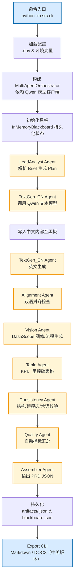

# 系统流程与创新点总览（v1）

本文档总结“多模态双语 PRD 自动生成与评测系统”的端到端流程、各模块功能以及创新要点，便于论文撰写、项目汇报及团队协作。

---

## 一、总体流程图

---

## 二、模块功能说明

| 模块 | 功能 | 输入/输出 | 依赖 |
| --- | --- | --- | --- |
| CLI (`src/cli.py`) | 载入配置、构建调度器、启动流程、输出日志 | Brief JSON、输出目录 | `dotenv`、`MultiAgentOrchestrator` |
| MultiAgentOrchestrator | 驱动各角色 Agent，统一黑板通信模式（同步/异步） | Agent 注册表、黑板 | `InMemoryBlackboard` |
| InMemoryBlackboard | 共享状态、消息队列、持久化（UTF-8） | AgentMessage | JSON 持久化 |
| LeadAnalyst Agent | 解析输入概要，输出结构化计划（章节、约束、Persona） | Brief | Plan JSON |
| TextGen Agents（中/英） | 调用 Qwen 文本模型生成章节内容 | Plan、Brief | 双语段落 |
| Alignment Agent | 检查缺失、长短差异、对齐情况 | 中文/英文内容 | 对齐指标、回溯指令 |
| Vision Agent | 调用 DashScope 图像接口或兼容模式生成流程/界面图；失败时占位 | Plan、Prompt | 图片文件/占位元数据 |
| Table Agent | 生成 KPI/里程碑/埋点等表格 | Plan、Brief | 表格 JSON |
| Consistency Agent | 检查结构完整度、语言缺失、锚点一致性 | 黑板状态 | 问题列表 |
| Quality Agent | 汇总自动指标 S_comp/S_mm/S_tab/S_bi/S_var | 黑板状态 | 指标字典 |
| Assembler Agent | 版本化 PRD Payload、保存 JSON、记录指标 | 黑板状态、Plan | `artifacts/prd_<id>.json` |
| CLI Export (`src/cli_export.py`) | 将结构化 PRD 渲染为 Markdown/DOCX，支持 `zh/en/auto` | PRD JSON | `python-docx`、模板渲染 |

---

## 三、关键创新点

1. **多智能体协同 + 黑板机制**  
   - 角色化 Agent 分工（需求分析、文本生成、对齐、视觉、表格、校验、质量汇总），通过消息队列与共享状态形成闭环。
   - 支持同步批量与异步队列通信模式，可用于消融实验（单体 vs 多 Agent、通信模式差异）。

2. **双语一致性与跨模态对齐**  
   - 中文/英文生成链路完全对等，并由 Alignment Agent 对段落缺失、段落长度差异做检查。
   - 表格、图片、流程图在 JSON 中维护锚点和引用，便于指标计算和人工评审。

3. **真实模型接入与占位策略共存**  
   - 文本：Qwen2/3、Doubao 等开源 LLM 通过兼容接口调用；  
   - 视觉：DashScope 官方 SDK + 兼容模式双通道，自动匹配分辨率；若模型不可用，则记录占位并保留流程可用。

4. **结构化指标与弱监督门控**  
   - 自动指标包括结构完整度、跨模态一致性、表格引用、双语一致性、稳定性等。  
   - 弱监督模块可根据指标阈值筛选高质量样本，支持后续半合成数据集构建。

5. **双语文档导出与模板化呈现**  
   - 自动生成 Markdown、DOCX（中文与英文版本），满足可读性需求。  
   - 单一 Schema 到多格式输出的流程便于后续接入 PPT、PDF、网页展示。

6. **实验友好性**  
   - 全流程可追踪（每个 Agent 日志、版本化输出）；  
  - 提供 CLI 对应的消融与自动评测脚本（Wilcoxon、Cliff’s δ、Bootstrap CI），便于撰写论文。

---

## 四、开发者提示

- 若需要自定义章节命名、字体或版式，可修改 `src/exporters/prd_renderer.py`；  
- DashScope 图像模型需配置 `DASHSCOPE_API_KEY` 和 `QWEN_VISION_SIZE`（默认 `1328x1328`）；  
- 当视觉模型不可用时，系统仍可生成文本 PRD，并在导出文档中标记缺失图片；  
- 可在 `.env` 中设置 `QWEN_VISION_MODEL=none` 来禁用图像生成，以加速实验或规避配额限制。

---

## 五、后续扩展方向

1. **多模板导出**：通过 Word 模板或前端渲染器生成企业风格文档。  
2. **更细粒度的对齐指标**：引入 CLIP/VLM 相似度、术语词表校验。  
3. **流程图程序化生成**：Mermaid/Excalidraw 自动绘制 + 图片生成模型增强。  
4. **实时交互界面**：构建可视化仪表盘，展示指标、版本对比、占位图提示。  
5. **模型切换/集群调度**：对接更多开源模型（如 Doubao、Yi、InternVL），支持负载均衡与成本控制。

---

如需将本文档导出或嵌入到论文/汇报材料中，可直接引用本文件或转换为 PDF。欢迎根据团队需求修改扩展。

